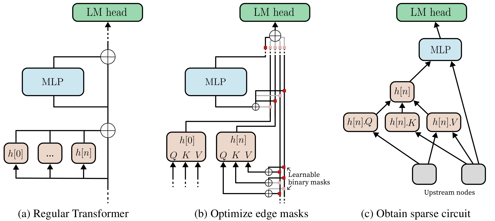
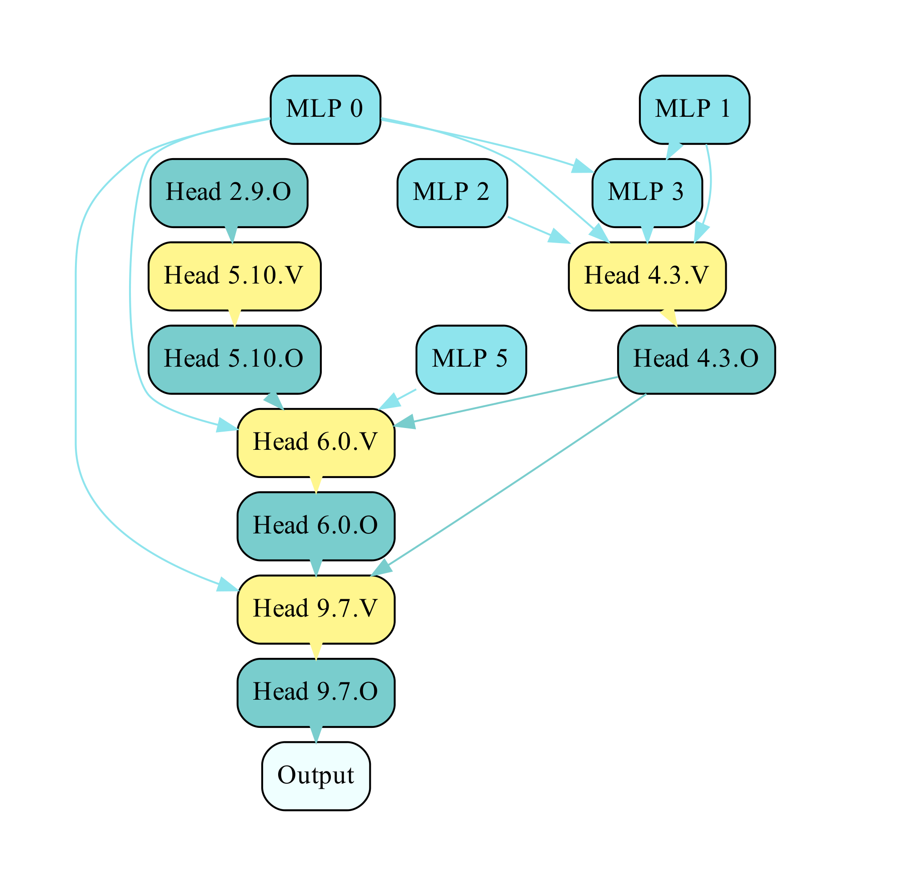

# Edge Pruning For Circuit Discovery


This repository contains the code and data for the paper "Finding Transformer Circuits with Edge Pruning".

## Quick Links

- [Environment](#environment)
- [Overview of Edge Pruning](#overview-of-edge-pruning)
- [Repository Structure](#repository-structure)
- [Running the Code](#running-the-code)
  - [GPT-2 Experiments](#gpt-2-experiments)
  - [Tracr Experiments](#tracr-experiments)
  - [CodeLlama Experiments](#codellama-experiments)
  - [Other Models](#other-models)
- [Bugs or Questions?](#bugs-or-questions)
- [Citation](#citation)

## Environment

After installing [PyTorch](https://pytorch.org), run
```
pip install -r requirements.txt
```
to install the required packages.

## Overview of Edge Pruning

The method itself is described in depth in our paper. Here we outline the implementation. 

We expand the hidden state tensor from `(batch_size, seq_len, hidden_dim)` to `(node, batch_size, seq_len, hidden_dim)`. This array acts as a sort of outbox for every node. Then, a downstream node can read its input via muxing these outboxes with a binary mask. The masks and their optimization are implemented with the [L0 trick](https://openreview.net/forum?id=H1Y8hhg0b) (described further in our paper)---this part of the code is in `src/modeling/l0.py`. We also provide some additional implementation comments here: since the "target" sparsities specified to the pruning scripts are just numbers, we can (and sometimes do) specify values above `1` to strongly push the model to be as sparse as possible. Also note that at the end of the training, we discretize the masks to `0` or `1` from their floating point values by rounding w.r.t a threshold. Instead of fixing the threshold to `0.5`, we perform a binary search during evaluating so that the final threshold causes a sparsity of exactly `1 - <average mask value>`.

## Repository Structure

> **_Note_:** Please unzip the `data.zip` file to the `data/` directory before running the code!

The repository is structured as follows.
- The `data/` folder contains everything related to datasets and their generation. Specifically, `data/datasets/` has the datasets for the various tasks used in our evaluation, while the scripts in `data/scripts/` use the seed data in `data/helper_files` to generate these datasets programatically. `data/tracr_models` contains the precompiled weights of the tracr models we use, while `data/runs` provides the final checkpoints of the pruned versions.
- `src/` houses the code related to actually performing the pruning, and evaluating the pruned circuits. In particular, `src/modeling` defines the model classes we use. `src/prune` provides fine-tuning scripts and `src/eval/` contains scripts that evaluate the produced circuits (or the whole model).
- `run_scripts/` contain helper scripts that both demonstrate and help with launching pruning and evaluation runs.
- `tracrx/` has a slightly modified [Tracr](https://github.com/google-deepmind/tracr) implementation. The modifications allow us to return the embedding matrix entries when calling the model, so that we can save all weights for future use in our equivalent Tracr class in PyTorch.
- `assets/` contains images used in this README.

## Running the Code

### GPT-2 Experiments

The datasets for `IOI-t1` / `IOI` (Indirect Object Identification), `GT` (Greater Than) and `GP` (Gendered Pronoun) are under `data/datasets/{ioi-t1/ioi/gt/gp}`. If you wish to re-generate these, use the scripts in `data/scripts/prepare_{ioi/gt/gp}.py`. The modeling file for GPT-2 is `src/modeling/modeling_fpt2.py`, and the pruning scripts are found at `src/prune/fpt2_{ioi/gt/gp}.py`. The IOI pruning script can also be used for IOI-t1.

A demonstration of how to use these scripts, along with the hyperparameters we used, is provided in `run_scripts/{ioi/gt/gp}_sweep.sh`. There are further explanations in these files, and flags for enabling a node loss (along with an edge loss) or to disallow removing edges of the form `embedding -> node`. Please note that---in contrast to some prior methods---we disallow removing edges of the form `head.Q/K/V -> head` since it is equivalent to removing all incoming edges of the former node.

Evaluation scripts are found in `src/eval/{ioi/gt/gp}.py`. To evaluate a circuit found with the default settings above, you can simply run, for example,
```
python src/eval/ioi.py -m /path/to/pruned_model -w
```
The `-w` flag signifies that embedding nodes were allowed to be pruned in the circuit. You can also use this script with the original GPT-2 model (or any GPT-2 checkpoint).

<p style="text-align: center">


<em text-align="center"> An example circuit </em>
</p>

**_Visualizing a GPT-2 circuit:_** The following two steps will let you generate a drawing of a circuit. First, save the circuit edges using `src/modeling/vis_fpt2.py` as follows:
```
python src/modeling/vis_fpt2.py -i /path/to/checkpoint/dir/ -w
```
This will save the edges (by default to `/path/to/checkpoint/dir/edges.json`), and `-w` tells the script that you model masks over embedding edges as well. Then, you can draw the circuit with
```
python src/modeling/draw_fpt2.py -i /path/to/checkpoint/dir/edges.json
```
The default output path is `edges.pdf`; please look at the scripts for other arguments. An example circuit is shown above.

### Tracr Experiments

The Tracr data and model preparation involves two steps (or you can use the datasets and models provided under `data/datasets/` and `data/tracr_models/`). We will illustrate them for the case of the task `reverse` (the files/steps for `xproportion` are the same, with the change `reverse -> xproportion`). You can call `data/scripts/prepare_reverse.py` to generate the dataset for the task. The model itself can be compiled by calling `data/scripts/prepare_reverse_tracr-model.py`. This will compile the tracr models using the `tracrx/` code and then save the weights as pickle files (by default under `data/tracr_models/`).

These weights are now compatible with our PyTorch model, defined in `src/modeling/modeling_erazr.py`. The pruning code in `src/prune/erazr_{reverse/xproportion}.py` is called upon by the helper scripts in `run_scripts/tracr_{reverse/xproportion}.sh`. The evaluation is performed at the end of the run by the pruning code itself. Please refer to the helper scripts for an example of how to launch a pruning run.

Extension to other tracr models should be straightforward by modifying the prepratation scripts above. However, note that Tracr seems to map the BOS token to a random index in its vocabulary for each task, and figuring out the specific index for may need an inspection of a few outputs.

### CodeLlama Experiments

The data preparation scripts for Boolean Expressions are provided under `data/datasets/`, and the dataset itself in `data/datasets/boolean_expressions/`. The modeling code is in `src/modeling/modeling_fllama.py` and the pruning code is in `src/prune/fllama_boolean_expressions_{fs/ip}.py` for instruction prompting and few-shot (in-context learning) settings. To directly evaluate the obtained checkpoints, use `src/eval/boolean_expressions.py` just like the GPT-2 evaluation scripts. This script has the following differences from the GPT-2 evaluation scripts:
- Use the flag `-m` or `--mode` to specify the mode of evaluation (`fewshot` or `instruction`).
- The `-e/--edges` flag allows you to specify a JSON file with a list of edges that are loaded into the model first: this lets you evaluate, e.g., the intersection of two models found with the file `src/modeling/vis_fllama.py` (use the `-m1`, `-m2` and `-o` flags to specify model paths and the output JSON path).
- You will probably need to launch this script with `4` (or more) GPUs: `run_scripts/launch_fllama_eval.sh` shows how to do this.
For the pruning itself, the helper scripts in `run_scripts/launch_fllama_{instr/fs}_prune.sh` use PyTorch FSDP and call upon `src/prune/fllama_boolean_expressions_{ip/fs}.py`. Note that these are sbatch scripts (despite having the `.sh` extension). Please refer to them for the hyperparameters we used (and find the FSDP config files under `run_scripts/fsdp_configs/`). The runs are quite resource-intensive and required us to use multi-node training with 32 GPUs.

> **_Note 1:_** We are aware of a bug in the CodeLlama pruning code due to which the loss starts out as a large negative number sometimes (when using multi-node training and initializing from a Llama checkpoint instead of our class). Terminating the run and re-launching it fixes the issue. Additionally, initializing from an Fllama class (load Llama into our class, then save to disk with `save_pretrained` and load that checkpoint instead) seems to help. We are looking into this bug and will fix it soon! 

> **_Note 2:_** To facilitate use with other models, we plan on releasing modeling files for a few popular architectures soon. Stay tuned!

### Other Models

Extension to other models should be straightforward by mimicking `modeling_{fpt2/fllama}.py` in modiyfing the corresponding HuggingFace model files (e.g., [`modeling_gpt2.py`](https://github.com/huggingface/transformers/blob/main/src/transformers/models/gpt2/modeling_gpt2.py)).

### Custom Dataset

Using a custom dataset with, e.g., the GPT-2 pruning script is as straightforward as writing into a JSONL file (`data/datasets/example_custom.jsonl`)
```
{
    "clean": "1 + 2 = <predict>3</predict>",
    "corrupted": "1 + 4 = <predict>5</predict>"
}
{
    "clean": "5 + 1 = <predict>6</predict>",
    "corrupted": "1 + 1 = <predict>2</predict>"
}
{
    "clean": "2 + 2 = <predict>4</predict>",
    "corrupted": "2 + 4 = <predict>6</predict>"
}
```
and calling the `src/prune/fpt2_custom.py` as in `run_scripts/custom_example.sh`. The part meant for the model to predict must be enclosed in `<predict></predict>`. You can also add a `split` key in your examples with value `train`/`validation`. If this key is missing, the entire dataset is used for both training and validation.

## Bugs or Questions?

Please reach out to Adithya `<adithyab@princeton.edu>` with any questions or bug reports.

## Citation

If you use our work and are inspired by our work, please consider citing us (available soon):

```
```